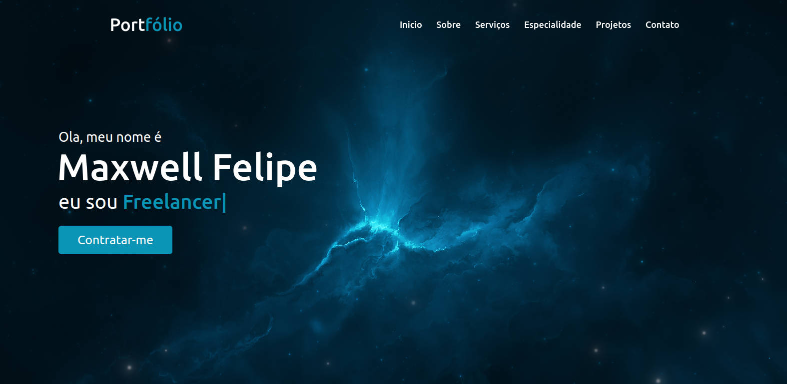

<h1 align="center">
  💻 Portfólio - Maxwell Felipe
</h1>

<h4 align="center"><a href="">Clique para visitar o projeto</a></h4>

## 📚 Seções

O site é composto por cinco seções:

- **Início:** Nele temos uma breve apresentação;
- **Sobre:** Nessa seção tenho uma descrição dizendo um pouco sobre quem sou;
- **Serviços:** Exibe através de cards os diferentes serviços em que possuo conhecimentos;
- **Projetos:** Apresenta alguns projetos desenvolvidos e com link direto para os respectivos códigos no GitHub;
- **Especialidade:** Nele apresentamos meus conhecimentos em algumas linguagens como o foco no front-end;
- **Contato:** Nele exibe minhas redes sociais e um link para enviar um email para contato via gmail.

---

## 💼 Tecnologias utilizadas

Para o desenvolvimento deste site utilizei as seguintes tecnologias:

- HTML;
- JavaScript;
- Css;

---

